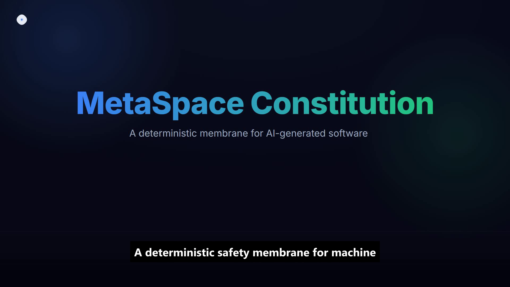

# MetaSpace Membrane

**A deterministic safety membrane for machine-generated software.**


MetaSpace Membrane turns an *undecidable* question — *"is this AI doing the right thing?"* —
into a *decidable* one — *"is this effect inside the declared boundary?"* — and enforces the
answer **deny-by-default**. One `.bio` constitution, three membranes, two products.

> Part of the **MetaSpace.Bio Engine Project** — Szőke László-Ferenc (admin@metaspace.bio).
> **Patent pending.**

---

## Watch the 60-second explainer

[](assets/explainer.mp4)

*Containment, not correctness — the idea in one minute.* ▶ click to play

---

## Why

You cannot prove that a generated program does the right thing (Rice's theorem — undecidable).
So we stop verifying intent and **contain effects** instead. A membrane sits at a chokepoint,
reads the constitution, and blocks anything not explicitly granted. A bug becomes *a deviation
from the constitution* — machine-measurable and enforceable.

The guarantee is only as hard as the chokepoint is unbypassable:

```
heuristic    ->  language guard  ->  harness hook  ->  WebAssembly
(advisory)       (bypassable)        (hard on agent)   (unbypassable)
```

---

## Two products, one engine

| | **Product A — App membrane** | **Product B — Agent membrane** |
|---|---|---|
| Contains | any application ⊂ its `.bio` | the coding assistant ⊂ its limits |
| Chokepoint | WebAssembly capability import | Claude Code PreToolUse hook |
| Guarantee | **unbypassable** (hard, WebAssembly only) | hard on the agent (sits outside it) |
| Status | WebAssembly/WASI **or** OS-sandbox (Landlock): real native programs, kernel-contained | **Warden MVP** — install → enforce → report loop, proven end-to-end |

Both are built on the same `core/` decision engine (`guard.py`) and the same `.bio` file.

---

## Status & maturity

This is a **research prototype / reference implementation** (TRL ~3–4). The mechanisms are real,
falsifiable, and enforced by real substrates — run `python evidence/run_falsification.py` to make
the repo try (and fail) to prove itself hollow, and `python evidence/run_fuzz.py` for 5000
adversarial cases. They are demonstrated on **real programs** and fuzzed inputs, but at lab scale,
by a single author, **without a third-party security audit or production users**. "Patent pending"
refers to the underlying method; the two "products" are working **proofs-of-concept**, not shipped
software. See [`SECURITY.md`](SECURITY.md) for the threat model and how to try to break it.

---

## The `metaspace` CLI

```bash
pip install .                             # installs the `metaspace` command
metaspace init .                          # synthesize a draft constitution from your code
metaspace ratify metaspace.bio            # review + justify + stamp RATIFIED
metaspace gate metaspace.bio              # exit 0 only if RATIFIED (use in CI)
metaspace report path/to/audit.jsonl      # human-readable session safety report
```

One entry point over the engine: `synthesize`, `ratify`, `gate`, `report`, `init`. Cross-platform
by construction, and **verified on Linux**: `run_proofs.py` is green on Debian (kernel 6.1,
Python 3.11) and on Windows — **21/21 on Linux** (including the kernel-enforced Landlock
sandbox) and 20 pass + 1 skip on Windows (the Landlock proof runs only where the OS provides
it). The runs also surfaced and fixed real bugs (a path-portability bug, a shared-parser bug).
macOS is not yet verified (no host available) — see [`SECURITY.md`](SECURITY.md).

---

## Run the proofs (the evidence is a reproducible run)

```bash
pip install wasmtime
python run_proofs.py        # runs every proof; exit 0 if all pass
```

Or run them individually:

```bash
python products/app_membrane/run_wasm_demo.py         # every capability kind mediated (FS/NET/ENV/SUBPROCESS): 4 ALLOW / 5 DENY
python products/app_membrane/bypass_proof.py          # ungranted gate -> unknown import (blocked)
python products/app_membrane/wasi/run_wasi_demo.py    # real Rust program contained by WASI capabilities
python evidence/run_landlock_demo.py                  # real native program OS-confined by .bio (Linux/Landlock, M3)
python evidence/demos/run_synth_demo.py               # code -> constitution -> enforcement (closed loop)
python evidence/demos/run_ratify_demo.py              # ratification is content-bound (tamper detected)
python evidence/demos/run_gate_demo.py                # production gate: only RATIFIED runs
python evidence/demos/run_knowledge_demo.py           # 2 ALLOW / 5 DENY (hallucination blocked)
python evidence/demos/run_entailment_demo.py          # soft tier flags faithfulness (never blocks)
python products/ai_membrane/test_hook.py              # 17/17
python evidence/run_product_e2e.py                    # Warden loop: real hook -> audit -> report (M1)
python evidence/run_falsification.py                  # self-falsification: proofs are real, not slop
```

The last one is a **self-falsification audit**: it mutates a constitution (the decision flips),
sabotages `guard.check()` (a proof then fails), and has WebAssembly itself refuse an ungranted
syscall — so the evidence is measuring real behaviour, not printing `PASS`.

No hosted CI required — the proof is a command anyone can run.

---

## MetaSpace Warden — the agent membrane (Product B)

**Warden** is the shipping product: a deny-by-default membrane for a Claude Code session. You
install it, it enforces a hardened default constitution from *outside* the agent, and it leaves
a session safety report. The whole loop is a reproducible proof
(`python evidence/run_product_e2e.py`), driving the *real* hook over a realistic session:

```
install the membrane  ->  the agent acts (writes, shell, fetches)
                      ->  the hook enforces the shipped constitution (deny-by-default)
                      ->  it logs a project-local audit (.metaspace/session_audit.jsonl)
                      ->  `metaspace report` summarizes what was blocked, by capability
```

In the proof, of a realistic 11-step session the membrane allows 6 legitimate actions and blocks
5 (a write outside the project, `git push`, `rm -rf /`, a `curl … | bash`, and a beacon to an
unlisted host) — then `metaspace report` shows the block breakdown (FILESYSTEM / SHELL / NETWORK).

**As a Claude Code plugin (one command):**

```
/plugin marketplace add LemonScripter/metaspace-membrane
/plugin install metaspace-membrane@metaspace
```

Restart the session and run `/hooks` to confirm the PreToolUse membrane is active. The plugin
ships a hardened default constitution (project-only writes, host allowlist, dangerous-command
block); `${CLAUDE_PROJECT_DIR}` is used as the project boundary automatically.

**Or as a portable installer** (writes `.claude/settings.json` directly, with an editable
constitution in `.claude/metaspace/`):

```bash
python products/ai_membrane/install.py /path/to/your/project
```

Restart the Claude Code session, then run `/hooks` to confirm it is active. Removing the hook
block reverts either method.

The session constitution is deny-by-default: writes are limited to the project directory,
outbound network to an allowlist, and dangerous shell patterns are blocked. The membrane logs
every decision to `.metaspace/session_audit.jsonl` in the project; after a session, see what it
blocked with:

```bash
metaspace report          # reads ./.metaspace/session_audit.jsonl by default
```

### Other harnesses: the generic MCP broker

The membrane's decision lives in one harness-independent core (`core/agent_adapter.py`); the
Claude Code hook is just one thin adapter over it. A second adapter — a generic **MCP
capability-broker** (`products/mcp_membrane/server.py`, a minimal JSON-RPC stdio server) —
exposes *mediated effect tools* (`fs_write`, `fs_read`, `net_fetch`) to any MCP-capable agent,
each gated by the same core, deny-by-default. `python evidence/run_mcp_e2e.py` drives both the
hook and the broker over their real interfaces and shows they reach identical verdicts.

**Honest condition (the hard-vs-advisory line):** an MCP tool the agent may *voluntarily* call
is only advisory — back to self-discipline, which does not contain a misaligned agent. The
broker is *hard* only when the agent is deployed with its ambient authority removed, so the
broker's tools are its **only** path to the filesystem/network. Under that condition the
guarantee equals the hook's; the broker cannot constrain effects reached through some other
unmediated tool.

---

## The `.bio` constitution

One file, three lenses:

```bio
CAPABILITIES {
  FILESYSTEM write "out/**"
  NETWORK    out   "api.allowed.com"
}

KNOWLEDGE {
  ENTITY order FROM "kb/orders.json"
  FIELD  order.status IN pending, shipped, delivered, refunded
  ACTUATE refund PROVENANCE verified_db
  CITATION REQUIRED
  SOURCE verified_db
}
```

- **Capability** — mediates effects on the world (deny-by-default).
- **Value invariant** — guards safety bounds.
- **Knowledge** — grounded facts only: no invented entities, no ungrounded actuation.

---

## Synthesize a constitution from code

Point the synthesizer at a file or directory; it detects the code's real effects
(filesystem, network, env, subprocess, hardware, import-path) and drafts a `.bio` — marked
`SYNTHESIZED`, since a human ratifies before it is trusted:

```bash
python synthesize.py path/to/app --out app.constitution.bio
```

`evidence/demos/run_synth_demo.py` runs the loop end-to-end: it synthesizes a constitution
from a sample app, feeds it straight into the membrane, and shows the app can then only do
what it declared — an effect it never had (a subprocess) is denied by default. This is a
static heuristic; the runtime membrane, not the synthesis, is the guarantee.

Ratify a reviewed constitution (SYNTHESIZED 🟡 → RATIFIED 🟢):

```bash
python ratify.py app.constitution.bio --yes
```

Ratification is **content-bound**: the stamp carries a fingerprint of the enforced policy, so
a later edit that widens a scope or adds a capability is detected as TAMPERED 🔴 — you cannot
ratify a policy and then quietly broaden it.

In production, gate the membrane on ratification — `Guard(..., require_ratified=True)` (or
`core.gate`) runs **only** a RATIFIED constitution; a SYNTHESIZED or TAMPERED one is refused,
fail-closed. A policy is enforceable only after human ratification.

Capabilities the dry-run learned are marked **provisional**: ratification is refused until each
carries a written `JUSTIFY` reason — a per-item, read-gated justification that defeats
rubber-stamping (`--yes` cannot bypass it). The code enforces the justification's *presence*,
not its *truth*, so the human's judgement on the reason still matters.

---

## Layout

```
core/          shared decision engine (guard, knowledge, analyzer, agent_adapter)
products/      app_membrane (WebAssembly + Landlock) · ai_membrane (hook + installer) · mcp_membrane (broker)
evidence/      runnable proofs + decisions
docs/          ARCHITECTURE.md
```

See [`docs/ARCHITECTURE.md`](docs/ARCHITECTURE.md) for the full technical background, or the
technical whitepaper [`docs/MetaSpace_Membrane_Whitepaper_EN.pdf`](docs/MetaSpace_Membrane_Whitepaper_EN.pdf)
(LaTeX source alongside; every claim is a reproducible run or true by construction).

---

## Honest limits

- Product A's hard guarantee requires a real substrate: the WebAssembly capability model, or an
  OS sandbox (**Landlock**, `products/app_membrane/sandbox_enforcer.py`) that confines a stock
  native program's filesystem writes to its `.bio` from the kernel. A language-level guard is
  bypassable and is not shipped as a product. The Landlock MVP confines *writes* (read/execute
  unrestricted so any binary runs); it is Linux-only and fail-closed if unavailable.
- The code→constitution synthesis is a static heuristic; a **dry-run learning mode**
  (`core/dryrun.py`) observes concrete runtime effects and augments the constitution *before*
  ratification, so it does not false-positive-block legitimate dynamic behaviour.
- The agent membrane affects tool effects, not the model's prose; its shell check is a
  **structural allowlist** (`core/shell_policy.py`) — obfuscation-resistant and fail-closed.
- The epistemic tier has two parts, named honestly: a **hard tier** that is a real
  deterministic *membrane* (it contains/blocks), and a **soft tier** that is *not* a membrane but
  an **advisory flag** (it qualifies/flags, never blocks). The reproducible threat-model matrix
  (`evidence/demos/run_threat_matrix_demo.py`, rendered in `docs/ARCHITECTURE.md`) shows exactly
  what each layer catches — including where a schema-valid but fabricated statement passes the
  hard layers and is only flagged.

---

© Szőke László-Ferenc — MetaSpace.Bio Engine Project. Patent pending. See [LICENSE](LICENSE).
